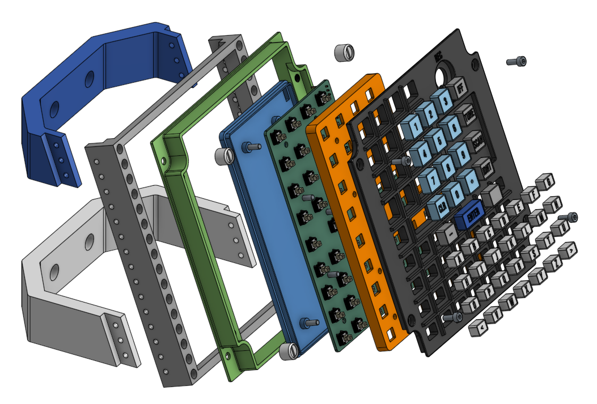

# OH-58D-MFK

[![CC BY-NC-SA 4.0][cc-by-nc-sa-shield]][cc-by-nc-sa]

## Work in progress

This project is still work in progress. Print and assemble at your own risk.

## 3D printed parts

You can find the CAD files on [Onshape](https://cad.onshape.com/documents/6787d83c44a91f8cde39e86e/w/96151ec904b149525745d522/e/fceb9b6b394f6e8ffc93c401). Currently you need to export the Onshape parts to get printable STLs files.

## License

Except where otherwise noted, this work © 2025 is licensed under a [Creative Commons Attribution-NonCommercial-ShareAlike 4.0 International License][cc-by-nc-sa].

[![CC BY-NC-SA 4.0][cc-by-nc-sa-image]][cc-by-nc-sa]

[cc-by-nc-sa]: http://creativecommons.org/licenses/by-nc-sa/4.0/
[cc-by-nc-sa-image]: https://licensebuttons.net/l/by-nc-sa/4.0/88x31.png
[cc-by-nc-sa-shield]: https://img.shields.io/badge/License-CC%20BY--NC--SA%204.0-lightgrey.svg